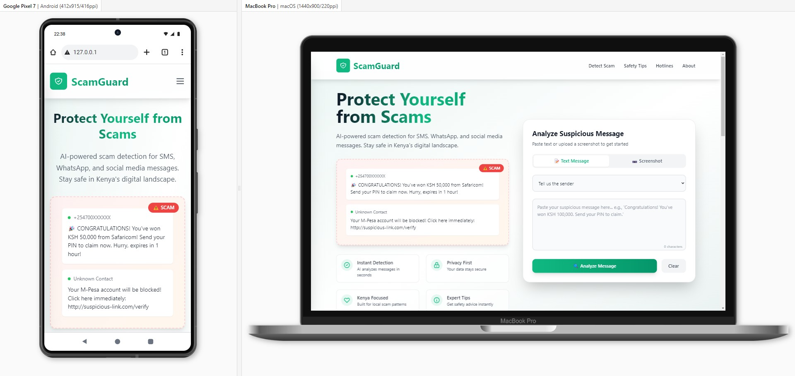

# 🚨 ScamGuard: AI-Driven Digital Shield Against Financial and Employment Scams in Kenya

## 📌 Overview

ScamGuard is an AI-powered web application built to protect Kenyans from the growing threat of digital scams—especially those targeting mobile money users and job seekers. By leveraging Natural Language Processing (NLP) and machine learning, ScamGuard analyzes suspicious messages and flags potential fraud in real time. Whether it's a fake job offer, a phishing link, or a deceptive payment request, ScamGuard helps users stay safe and informed.

## 🎯 Objectives

- Detect and flag scam messages using AI
- Empower users to make safer financial and employment decisions
- Promote digital literacy and scam awareness
- Support Kenya’s Digitization and TVET for Sustainable Development goals

## 🧠 Features

- 🔍 **Real-Time Scam Detection**: Paste a message or upload a screenshot—ScamGuard instantly analyzes it for scam indicators.
- 🧾 **Pattern Recognition**: Identifies common scam tactics like fake job offers, urgent payment requests, and suspicious links.
- 📚 **Digital Literacy Hub**: Educates users on how scams work and how to avoid them.
- 🌐 **Localized Protection**: Tailored to Kenya’s digital landscape, including M-Pesa and mobile banking platforms.

## 🛠️ Technologies Used

- **Frontend**: HTML, CSS, JavaScript (React or Vue recommended)
- **Backend**: Node.js / Python (Flask or Django)
- **AI & NLP**: TensorFlow / Scikit-learn / spaCy
- **Database**: MongoDB / PostgreSQL
- **Cloud Hosting**: Firebase / Heroku / AWS

## 📈 How It Works

1. User inputs a suspicious message or uploads a screenshot.
2. NLP engine parses the text and matches it against known scam patterns.
3. Machine learning model assigns a risk score and flags potential threats.
4. ScamGuard displays results and educates the user on the scam type.

## 🧪 Sample Scam Patterns Detected

| Pattern Type                  | Examples                                |
|------------------------------|-----------------------------------------|
| Request for PIN/OTP          | "Send your OTP to confirm"              |
| Urgency                      | "Act immediately or your account closes"|
| Payment Request              | "Send money via M-Pesa to proceed"      |
| Suspicious Link              | "Click here: http://bit.ly/xyz"         |
| Fake Job Offer               | "Earn 10,000/week working from home"    |

## 🚀 Getting Started

1. Clone the repository  
   `git clone https://github.com/yourusername/scamguard.git`

2. Install dependencies  
   `npm install` or `pip install -r requirements.txt`

3. Run the app  
   `npm start` or `python app.py`

4. Open in browser  
   `http://localhost:3000`

## 📚 Educational Resources

ScamGuard includes a learning module with:
- Common scam examples
- Tips for identifying fraud
- Real stories from affected users
- Links to report scams to relevant authorities

## 🤝 Contributing

We welcome contributions from developers, educators, and cybersecurity experts. To contribute:
- Fork the repo
- Create a feature branch
- Submit a pull request with clear documentation

## 📄 License

This project is licensed under the MIT License.

## 🌍 Impact

ScamGuard is more than a tool—it’s a movement toward safer digital engagement in Kenya. By combining technology with education, we aim to build a resilient, informed, and empowered digital community.
